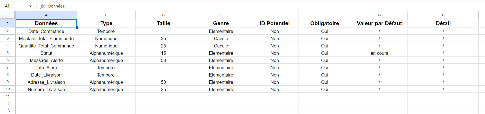
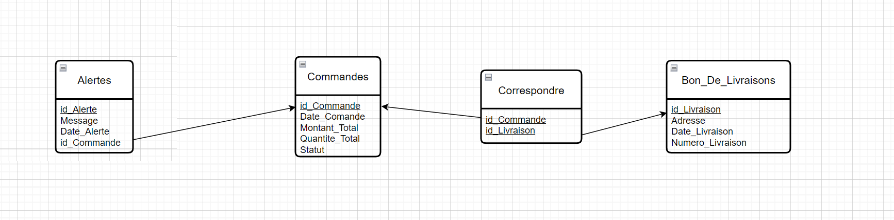
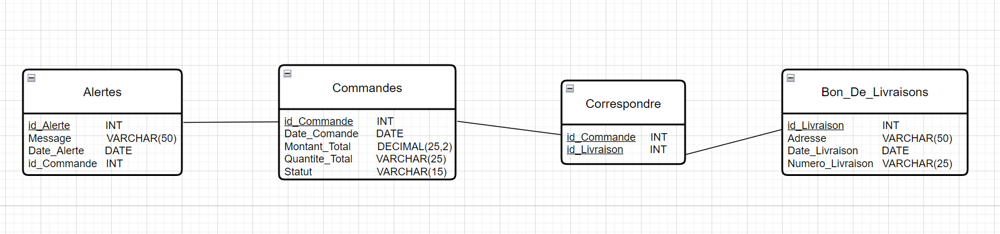

# Module vente

## Le Dictionnaire de données 

## MCD (Modèle Conceptuel de Données)

## MLD (Modèle Logique de Données)

## MPD (Modèle Physique de Données)

## Création de la base de données

[Création de la base de données](./Documents/create_database.md)

## Création des tables

[Création des tables](./Documents/create_tables.md)

## Les procédures stockées

[Procédures Stockées pour le CRUD](./Documents/procedure_stockee.md)

## Trigger

[Trigger](./Documents/trigger.md)

## Vérification du stock en collaboration avec un autre module

[Vérification du stock avant la commande](./Documents/verif_stock.md)