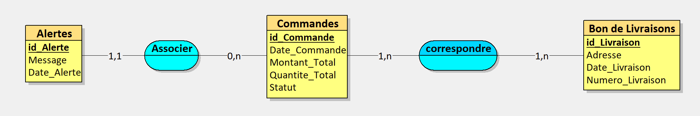

# Module vente

Ce projet et un projet final, qui permet de travailler en collaboration avec différents groupes qui auront un module à mettre en commun pour créer une Base de données.
Je me suis occupé seul de la partie vente. Vous pouvez retrouver les différents schémas correspondant à la Méthode Merise.
J'ai travaillé avec ces différents modules : Stock, relation client, comptabilité, marketing.
J'ai particulièrement collaboré avec la gestion du stock, mais j'ai dû mettre en commun mes différentes informations pour les autres groupes et leur expliquer mon point de vue.

## Le Dictionnaire de données 

## MCD (Modèle Conceptuel de Données)

## MLD (Modèle Logique de Données)

## MPD (Modèle Physique de Données)

## Création de la base de données

Requête SQL pour la création de la Base de Données

[Création de la base de données](./Documents/create_database.md)

## Création des tables

Voici les différentes requêtes pour créer les tables

[Création des tables](./Documents/create_tables.md)

## Les procédures stockées

Nous avons une procédure stockée pour chaque élément d'un CRUD (CREATE READ UPDATE DELETE) pour les éléments de la table Bon de Livraison

[Procédures Stockées pour le CRUD](./Documents/procedure_stockee.md)

## Trigger

Le Trigger va permettre d'ajouter automatiquement à la table "Alertes" un message et une date lorsque nous dépassons une commande supérieur ou égale à 3000€

[Trigger](./Documents/trigger.md)

## Vérification du stock en collaboration avec un autre module

Pour cette partie, je me suis basé sur ce que le groupe module stock (Théo et Louis) à réalisé.
J'ai donc travaillé en collaboration sur cette partie avec eux.

[Vérification du stock avant la commande](./Documents/verif_stock.md)